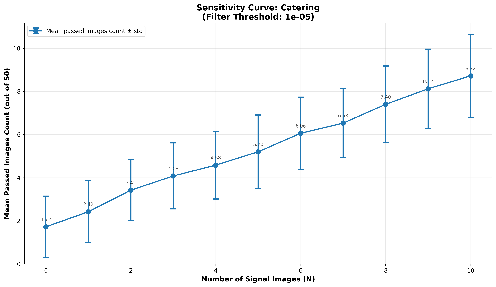
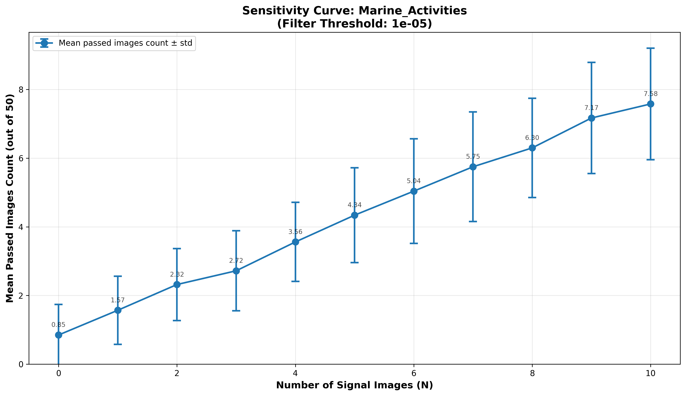
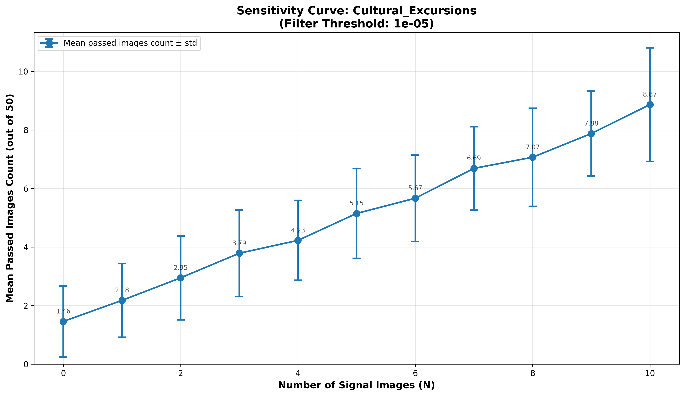
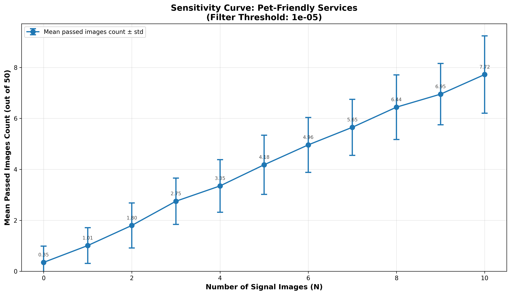

## Огляд попередніх етапів дослідження

**Етап 1: Бінарна класифікація та відбір моделі.** На першому етапі було проведено порівняльний аналіз шести pretrained моделей комп'ютерного зору (YOLO, BLIP, Grounding DINO, CLIP, SigLIP) для виявлення бізнес-релевантного контенту в чотирьох категоріях (Catering, Marine Activities, Cultural Excursions, Pet-Friendly Services). Основним завданням було знайти модель, яка одночасно забезпечує високу точність (Precision > 0.9) та прийнятну повноту (Recall ≥ 0.8). В результаті ітеративної розробки було створено оптимізовану версію SigLIP (V2 Ensemble), яка продемонструвала найкращий баланс метрик (F1 = 0.867, Precision = 0.925, Recall = 0.820) та була обрана для подальших експериментів.

**Етап 2: Мультикласова класифікація та порогова фільтрація.** Другий етап був присвячений валідації обраної моделі на більш складній мультикласовій задачі з 5 класами (4 бізнес-категорії + Irrelevant) на датасеті з 2500 зображень. Базова модель показала високу повноту (Recall = 0.9065), але недостатню точність (Precision = 0.8154) через велику кількість хибних спрацювань на нерелевантному контенті. Для вирішення цієї проблеми було запроваджено механізм порогової фільтрації, і через grid search визначено оптимальний поріг (threshold = 0.000010), який підвищив середню точність бізнес-категорій до 0.9158 при збереженні прийнятної повноти (0.7745) та Macro F1 = 0.7931.

# Звіт про Етап 3: Ієрархічна тегізація профілів користувачів

## 3.1. Мета та Завдання

Третій етап дослідження був присвячений валідації ієрархічної бізнес-логіки для класифікації профілів користувачів. На відміну від бінарної (Етап 1) та мультикласової (Етап 2) класифікації окремих зображень, завданням цього етапу було створення "портрета інтересів" користувача.

Мета полягала в тому, щоб на основі агрегованих прогнозів моделі для набору зображень коректно присвоїти профілю мультилейблову (multi-label) комбінацію тегів, що ідентифікують рівень зацікавленості (Hobbyist, User) у чотирьох бізнес-категоріях, або класифікувати профіль як Noise (Шум).

## 3.2. Методологія Експерименту

### 3.2.1. Генерація Ground Truth (GT) Датасету

Основою експерименту став синтетичний датасет, розширений до **1500 профілів** (загалом 67 650 зображень), що імітує реалістичний розподіл інтересів користувачів. Профілі були чітко сегментовані на три групи для валідації ієрархічної логіки, причому сегменти не були "стерильними", а містили контрольований рівень шуму.

**Hobbyist (Хобі) (500 профілів):**
- **Визначення**: Профілі з одним яскраво вираженим домінантним інтересом.
- **Склад**: 50-60% контенту належить до однієї бізнес-категорії, з ймовірністю 50% ще 15-25% контенту належить до однієї з трьох інших бізнес-категорії, решта - нерелевантні зображення.

**User (Користувач) (500 профілів):**
- **Визначення**: Профілі з помірним інтересом до кількох категорій одночасно.
- **Склад**: 15-25% контенту в кожній з 1-4 бізнес-категорій (кількість бізнес категорій визначалась випадковим чином, але не менше однієї категорії).

**Noise (Шум) (500 профілів):**
- **Визначення**: Профілі без значущих бізнес-інтересів.
- **Склад**: 0-5% контенту в кожній з 0-4 бізнес-категорій (кількість бізнес категорій визначалась випадковим чином).

### 3.2.2. Логіка Мультилейблової Тегізації (GT)

Важливою особливістю експерименту є те, що GT-теги профілів не були взаємовиключними. Через "нестерильність" генерації, профіль міг бути одночасно "Хобістом" в одній категорії та "Користувачем" в іншій.

Наприклад, профіль "Hobbyist" (згенерований з 52% Catering) міг випадково отримати 21% контенту Marine_Activities. Його коректний GT-вектор тегів у такому випадку був `{'Hobbyist_Catering', 'User_Marine'}`. Це дозволило перевірити здатність системи розпізнавати складні, змішані портрети інтересів, а не лише один домінантний клас.

### 3.2.3. Процес Аналізу та Оцінки

Процес аналізу складався з трьох кроків:

1. **Генерація прогнозів**: Модель (SigLIP), розроблена на Етапі 2, обробила всі 67 650 зображень для отримання "сирих" векторів прогнозів (raw scores) для 5 класів.

2. **Ієрархічна тегізація**: Було застосовано алгоритм, що перетворює агрегований вектор "raw scores" профілю у набір тегів. Алгоритм базувався на трьох порогових значеннях:
   - **Filter Threshold** (Поріг фільтрації для відсіювання "шуму" на рівні зображення, аналогічно логіки експериментустадії №2 дослідження).
   - **Hobbyist Threshold** (Мінімальна частка контенту для тегу "Хобі").
   - **User Threshold** (Мінімальна частка контенту для тегу "Користувач").

3. **Пошук оптимальних порогів (Grid Search)**: Був проведений  пошук по сітці (605 комбінацій) для знаходження конфігурації порогів, яка максимізує головну метрику.

В якості основної метрики оцінки, зважаючи на мультилейбловий характер задачі, було обрано **Sample-Based F1-Score**. Додатково розраховувалися **Exact Match Ratio (EMR)** та **Precision/Recall** для кожної групи тегів (Hobbyist_* та User_*).

## 3.3. Результати та Їх Аналіз

Розширення вибірки до **1500 профілів** дозволило отримати більш статистично значущі результати в порівнянні з тестовими обчисленням на 120 профілях та призвело до покращення ключових показників.

### Оптимальна конфігурація (визначена Grid Search):

- **Filter Threshold**: 0.000010
- **Hobbyist Threshold**: 0.2750 (27.5%)
- **User Threshold**: 0.1275 (12.75%)

### Ключові метрики (Рівень Профілів):

- **Sample F1-Score**: 0.8957
- **Exact Match Ratio (EMR)**: 0.7775

Ці показники (F1 ≈ 0.90) демонструють високу ефективність розробленої ієрархічної логіки у створенні коректних "портретів інтересів".

### Аналіз Precision / Recall:

- **Hobbyist Tags**: Precision = 0.9726, Recall = 0.9775
- **User Tags**: Precision = 0.9416, Recall = 0.7881

Аналіз метрик підтверджує, що система успішно реалізує ключову бізнес-вимогу — **високу точність (Precision)**. Показники 97.3% та 94.2% вказують на те, що система ефективно справляється з шумом і робить мінімальну кількість хибно-позитивних спрацювань (False Positives) при присвоєнні бізнес-тегів. Помірне зниження Повноти (Recall) для тегів User (78.8%) є очікуваним та прийнятним компромісом (trade-off) для досягнення такої високої точності.

### Узгодженість порогів:

Важливим результатом є те, що оптимальний **Filter Threshold (0.000010)** поріг фільтрації шуму для профілів повністю збігся з оптимальним порогом, визначеним під час окремого аналізу на рівні зображень (де він забезпечив Macro F1 = 0.7344). Це підтверджує валідність та узгодженість обраної стратегії фільтрації.

Оптимальні пороги тегування (27.5% / 12.75%) виявилися нижчими за закладені в Ground Truth (50% / 15%). Це є логічним калібруванням системи: оскільки Filter Threshold відсіює частину сигналу, Повнота (Recall) на рівні зображень для цього порогу становить ≈ 72.9%. Grid Search емпірично знайшов пороги, що відповідають цій ослабленій, але очищеній від шуму, силі сигналу.

## 3.4. Висновок Етапу 3

Експеримент на розширеній вибірці (**1500 профілів**) повністю підтвердив та покращив результати пілотного тесту. Досягнуто високої якості мультилейблової класифікації профілів (**Sample F1-Score = 0.8957**). Доведено, що розроблена ієрархічна модель є надійним інструментом для ідентифікації бізнес-інтересів користувачів, демонструючи високу точність (Precision > 0.94) та ефективно мінімізуючи вплив "шумного" контенту.

## 4. Етап 4: Аналіз чутливості системи

### 4.1. Мета експерименту

Основною метою четвертої експериментальної фази був кількісний аналіз чутливості класифікаційної системи. Завдання полягало у визначенні залежності між кількістю релевантних ("сигнальних") зображень ($N$) у профілі користувача та сукупним відгуком системи.

Ключова ціль — встановити мінімальний поріг сигналу (Reliable $N$), тобто мінімальну кількість релевантних зображень, яка необхідна для надійної ідентифікації профілю як "цільового" та його статистично значущого відділення від профілів, що містять лише "шум" ($N=0$).

### 4.2. Методологія та формування вибірки

Для проведення аналізу було процедурно згенеровано синтетичний набір даних, що охоплював чотири бізнес-категорії: "Catering", "Marine_Activities", "Cultural_Excursions" та "Pet-Friendly Services".

Для кожної категорії було сформовано 11 груп профілів, що відповідали рівням сигналу від $N=0$ до $N=10$. Кожен профіль у вибірці мав фіксований розмір — 50 зображень. Профіль з рівнем $N=X$ містив $X$ сигнальних зображень та $(50-X)$ іррелевантних (шумових) зображень.

Для забезпечення статистичної стійкості, для кожного рівня $N$ (включно з $N=0$) було згенеровано 100 профілів-повторень. Таким чином, загальний обсяг вибірки для однієї категорії склав 1100 профілів (11 рівнів × 100 повторень), а загальний експеримент охопив 4400 профілів.

Кожен профіль було проаналізовано системою з використанням встановленого порогового значення фільтрації ($1 \times 10^{-5}$). Ключовою метрикою для кожного профілю слугувала загальна кількість зображень, що подолали цей поріг.

### 4.3. Результати аналізу

Аналіз виявив суттєві відмінності у чутливості системи залежно від семантичної складності категорії. Для кожної категорії було розраховано детальні статистичні показники (середнє, стандартне відхилення, процентилі).

# Детальна статистика чутливості (n=100)

## Таблиця 1. Категорія "Catering"

| N  | mean | std  | mean-std | mean+std | p10  | p90   |
|:--:|:----:|:----:|:--------:|:--------:|:----:|:-----:|
| 0  | 1.72 | 1.43 | 0.29     | 3.15     | 0.00 | 4.00  |
| 1  | 2.42 | 1.44 | 0.98     | 3.86     | 1.00 | 4.00  |
| 2  | 3.42 | 1.41 | 2.01     | 4.83     | 2.00 | 5.00  |
| 3  | 4.08 | 1.53 | 2.55     | 5.61     | 2.00 | 6.00  |
| 4  | 4.58 | 1.57 | 3.01     | 6.15     | 3.00 | 7.00  |
| 5  | 5.20 | 1.71 | 3.49     | 6.91     | 3.00 | 8.00  |
| 6  | 6.06 | 1.68 | 4.38     | 7.74     | 4.00 | 8.00  |
| 7  | 6.53 | 1.60 | 4.93     | 8.13     | 4.00 | 9.00  |
| 8  | 7.40 | 1.78 | 5.62     | 9.18     | 5.00 | 10.00 |
| 9  | 8.12 | 1.84 | 6.28     | 9.96     | 6.00 | 10.00 |
| 10 | 8.72 | 1.93 | 6.79     | 10.65    | 6.00 | 11.00 |

---

---

## Таблиця 2. Категорія "Marine_Activities"

| N  | mean | std  | mean-std | mean+std | p10  | p90   |
|:--:|:----:|:----:|:--------:|:--------:|:----:|:-----:|
| 0  | 0.85 | 0.89 | -0.04    | 1.74     | 0.00 | 2.00  |
| 1  | 1.57 | 0.99 | 0.58     | 2.56     | 0.00 | 3.00  |
| 2  | 2.32 | 1.05 | 1.27     | 3.37     | 1.00 | 4.00  |
| 3  | 2.72 | 1.17 | 1.55     | 3.89     | 1.00 | 4.00  |
| 4  | 3.56 | 1.15 | 2.41     | 4.71     | 2.00 | 5.00  |
| 5  | 4.34 | 1.38 | 2.96     | 5.72     | 3.00 | 6.00  |
| 6  | 5.04 | 1.52 | 3.52     | 6.56     | 3.00 | 7.00  |
| 7  | 5.75 | 1.60 | 4.15     | 7.35     | 4.00 | 8.00  |
| 8  | 6.30 | 1.45 | 4.85     | 7.75     | 4.00 | 8.00  |
| 9  | 7.17 | 1.62 | 5.55     | 8.79     | 5.00 | 9.00  |
| 10 | 7.58 | 1.63 | 5.95     | 9.21     | 5.00 | 10.00 |

---

---

## Таблиця 3. Категорія "Cultural_Excursions"

| N  | mean | std  | mean-std | mean+std | p10  | p90   |
|:--:|:----:|:----:|:--------:|:--------:|:----:|:-----:|
| 0  | 1.46 | 1.21 | 0.25     | 2.67     | 0.00 | 3.00  |
| 1  | 2.18 | 1.26 | 0.92     | 3.44     | 1.00 | 4.00  |
| 2  | 2.95 | 1.43 | 1.52     | 4.38     | 1.00 | 4.10  |
| 3  | 3.79 | 1.48 | 2.31     | 5.27     | 2.00 | 6.00  |
| 4  | 4.23 | 1.36 | 2.87     | 5.59     | 2.90 | 6.00  |
| 5  | 5.15 | 1.53 | 3.62     | 6.68     | 3.00 | 7.00  |
| 6  | 5.67 | 1.48 | 4.19     | 7.15     | 4.00 | 8.00  |
| 7  | 6.69 | 1.43 | 5.26     | 8.12     | 5.00 | 8.00  |
| 8  | 7.07 | 1.67 | 5.40     | 8.74     | 5.00 | 9.00  |
| 9  | 7.88 | 1.45 | 6.43     | 9.33     | 6.00 | 10.00 |
| 10 | 8.87 | 1.94 | 6.93     | 10.81    | 6.00 | 11.00 |

---

---

## Таблиця 4. Категорія "Pet-Friendly Services"

| N  | mean | std  | mean-std | mean+std | p10  | p90  |
|:--:|:----:|:----:|:--------:|:--------:|:----:|:----:|
| 0  | 0.35 | 0.64 | -0.29    | 0.99     | 0.00 | 1.00 |
| 1  | 1.01 | 0.70 | 0.31     | 1.71     | 0.00 | 2.00 |
| 2  | 1.80 | 0.88 | 0.92     | 2.68     | 1.00 | 3.00 |
| 3  | 2.75 | 0.91 | 1.84     | 3.66     | 2.00 | 4.00 |
| 4  | 3.35 | 1.03 | 2.32     | 4.38     | 2.00 | 4.00 |
| 5  | 4.18 | 1.16 | 3.02     | 5.34     | 3.00 | 5.00 |
| 6  | 4.96 | 1.08 | 3.88     | 6.04     | 4.00 | 6.00 |
| 7  | 5.65 | 1.10 | 4.55     | 6.75     | 4.00 | 7.00 |
| 8  | 6.44 | 1.27 | 5.17     | 7.71     | 5.00 | 8.00 |
| 9  | 6.95 | 1.20 | 5.75     | 8.15     | 5.00 | 8.00 |
| 10 | 7.72 | 1.52 | 6.20     | 9.24     | 6.00 | 10.00 |

Для визначення "Reliable N" було використано два статистичні критерії:

1. **Підхід mean ± std (рівень довіри ~84%)**: Сигнал $N=X$ вважався надійним, якщо його нижня статистична межа ($\text{mean} - \text{std}$) перевищувала верхню межу шуму ($\text{mean} + \text{std}$ для $N=0$).

2. **Підхід p10/p90 (рівень довіри ~90%)**: Більш консервативний непараметричний підхід. Сигнал $N=X$ вважався надійним, якщо його 10-й процентиль ($p_{10}$) перевищував 90-й процентиль ($p_{90}$) шуму $N=0$.

Зведені результати для обох підходів наведено в таблицях 2 і 3.

**Таблиця 2. Зведений аналіз чутливості (Підхід mean ± std, довіра ~84%)**

| Категорія                  | N=0 Mean | N=0 +std (Поріг шуму) | Reliable N (X) | N=X -std (Поріг сигналу) | N=X Mean |
|:---------------------------|:--------:|:------------------------:|:--------------:|:---------------------------:|:--------:|
| Catering                   | 1.72     | 3.15                     | 5              | 3.49                        | 5.20     |
| Marine_Activities          | 0.85     | 1.74                     | 4              | 2.41                        | 3.56     |
| Cultural_Excursions        | 1.46     | 2.67                     | 4              | 2.87                        | 4.23     |
| Pet-Friendly Services      | 0.35     | 0.99                     | 3              | 1.84                        | 2.75     |

---

**Таблиця 3. Зведений аналіз чутливості (Підхід p10/p90, довіра ~90%)**

| Категорія                  |          | N=0 p90 (Поріг шуму) | Reliable N (X) | N=X p10 (Поріг сигналу) | N=X Mean |
|:---------------------------|:--------:|:-----------------------:|:--------------:|:--------------------------:|:--------:|
| Catering                   |          | 4.00                    | 8              | 5.00                       | 7.40     |
| Marine_Activities          |          | 2.00                    | 5              | 3.00                       | 4.34     |
| Cultural_Excursions        |          | 3.00                    | 6              | 4.00                       | 5.67     |
| Pet-Friendly Services      |          | 1.00                    | 3              | 2.00                       | 2.75     |

### 4.4. Висновки

Аналіз чутливості продемонстрував чітку диференціацію у складності виявлення для різних категорій, що безпосередньо пов'язано з рівнем "шуму" (хибних спрацьовувань), який генерує кожна категорія.

**Найвища чутливість:** Категорія "Pet-Friendly Services" показала найкращі результати. Вона має найнижчий рівень шуму ($N=0 \text{ p}_{90} = 1.00$). Це означає, що 90% "пустих" профілів показують 1 або менше хибних спрацьовувань, і лише 10% показують 2 або більше. Для надійної ідентифікації (з 90% довірою) системі потрібно, щоб профіль мав $N=3$ вхідних сигнальних зображень; це забезпечує, що 90% таких профілів ($p_{10}$) покажуть 2.00 або більше сигналів, що надійно перевищує поріг шуму.

**Найнижча чутливість:** Категорія "Catering" виявилася найскладнішою. Вона генерує найвищий рівень шуму ($N=0 \text{ p}_{90} = 4.00$). Це означає, що 90% "пустих" профілів показують 4 або менше хибних спрацьовувань, але 10% показують 5 або більше. Внаслідок цього, для надійного виявлення сигналу (з 90% довірою) системі потрібно аж $N=8$ вхідних сигнальних зображень. Це забезпечує, що 90% таких профілів ($p_{10}$) покажуть 5.00 або більше сигналів, що перевищує поріг шуму.

**Проміжні результати:** Категорії "Marine_Activities" ($N=0 \text{ p}_{90} = 2.00$) та "Cultural_Excursions" ($N=0 \text{ p}_{90} = 3.00$) показали середні результати, вимагаючи $N=5$ та $N=6$ вхідних зображень відповідно, щоб надійно перевищити відповідні пороги шуму.

Експеримент підтверджує, що ефективність системи безпосередньо залежить від семантичної виразності та "шумності" цільової категорії. Для категорій з чіткими візуальними ознаками (наприклад, "тварини") потрібен значно менший обсяг сигналу, ніж для семантично розмитих категорій (наприклад, "їжа/ресторани", які можуть змішуватися з побутовими сценами).

---

### 4.5. Практичний висновок (Пороги виявлення)

Експеримент дозволяє встановити практичні пороги виявлення (Detection Thresholds). Це мінімальна кількість зображень, яку система має фактично розпізнати в профілі, щоб класифікувати його як "зацікавлений" із 90% статистичною впевненістю (тобто перевищити 90% рівень шуму).

**Таблиця 4. Практичні пороги виявлення (за 90% критерієм p10/p90)**

| Категорія                  | Поріг шуму (N=0 p90) | Поріг виявлення (Detection Threshold) | Необхідний N (Вхідні зображення) |
|:---------------------------|:-----------------------:|:----------------------------------------:|:-----------------------------------:|
| Pet-Friendly Services      | 1.00                    | 2                                        | $N=3$                               |
| Marine_Activities          | 2.00                    | 3                                        | $N=5$                               |
| Cultural_Excursions        | 3.00                    | 4                                        | $N=6$                               |
| Catering                   | 4.00                    | 5                                        | $N=8$                               |

**Висновок:** Для того, щоб з 90% впевненістю класифікувати зацікавленість користувача, система має фактично виявити 2 релевантних зображення для "Pets", 3 для "Marine", 4 для "Cultural" та 5 для "Catering". Експеримент також показує, скільки вхідних сигнальних зображень ($N$) необхідно для досягнення цих порогів надійності.

### Перевірка припущення про нормальність розподілу

Також слід зазначити, що не варто спиратися на мінімальні пороги чутливості, визначені в таблиці 2, оскільки перевірка на нормальність за допомогою тесту Шапіро-Вілка не підтвердила гіпотезу про нормальний розподіл.

**Тест Шапіро-Вілка (Shapiro-Wilk Test)**

Рівень значущості: α = 0.05. Якщо p-value ≤ 0.05, розподіл **НЕ** є нормальним.

| Категорія                  | Max p-value | N   | Висновок        |
|:---------------------------|:-----------:|:---:|:----------------|
| Catering                   | 0.0175      | 9   | НЕ нормальний   |
| Marine_Activities          | 0.0016      | 7   | НЕ нормальний   |
| Cultural_Excursions        | 0.0301      | 10  | НЕ нормальний   |
| Pet-Friendly Services      | 0.0005      | 10  | НЕ нормальний   |

**Висновок:** Оскільки для всіх категорій максимальні p-value не перевищують рівень значущості α = 0.05, гіпотеза про нормальність розподілу відхиляється. Тому підхід mean ± std (Таблиця 2), який базується на припущенні нормальності, є **некоректним** для цих даних. Для аналізу слід використовувати **непараметричний підхід p10/p90** (Таблиця 3).
